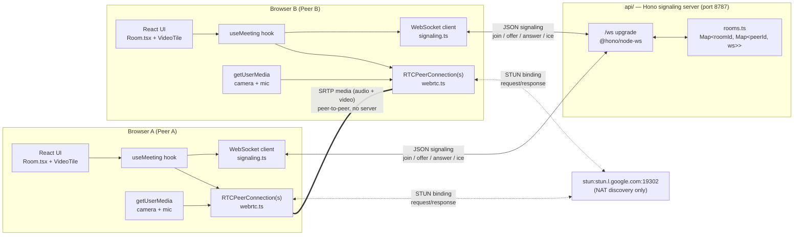
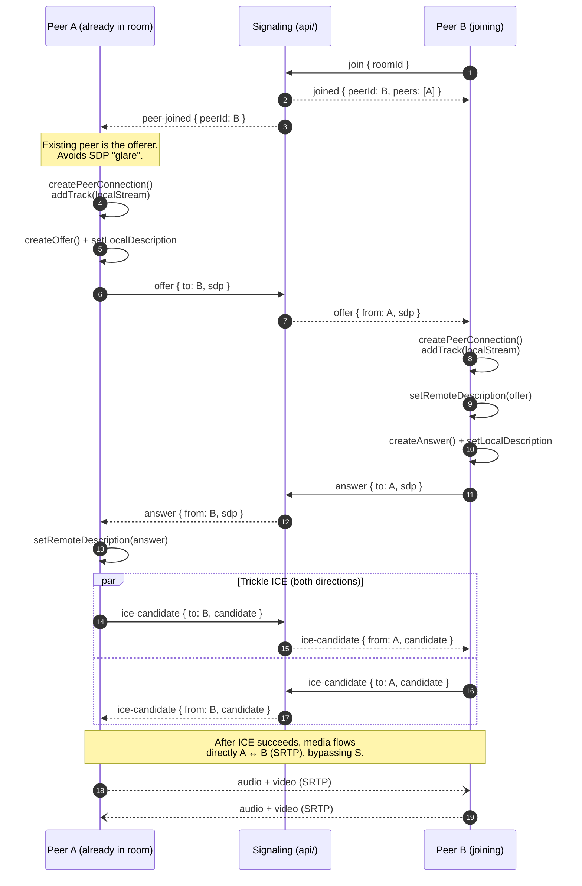

# WebRTC Meet POC — Documentation

A Google Meet–style proof of concept for small group video calls, built with a **mesh WebRTC** topology and a tiny **signaling server**. No SFU, no media server — all audio/video flows **peer‑to‑peer** between browsers. The backend exists only to help peers find each other and exchange the metadata needed to open direct connections.

---

## 1. Project layout

The repo is a pnpm workspace with two sibling projects:

```
webrtc-demo/
├── api/         # Hono + @hono/node-ws signaling server (port 8787)
├── app/         # Vite + React + TS + Tailwind + shadcn/ui client (port 5173)
└── pnpm-workspace.yaml
```

| Project | Role | Stack |
| --- | --- | --- |
| `api/` | Signaling only. Relays JSON messages between peers over WebSocket. Does **not** touch media. | Hono, `@hono/node-server`, `@hono/node-ws`, `nanoid`, tsx |
| `app/` | The client. Captures camera/mic, opens `RTCPeerConnection`s to every other peer, renders the video grid. | React 19, React Router, Vite, Tailwind v4, shadcn/ui, sonner |

---

## 2. How it works (high level)

1. User opens `/` (the `Home` page) and either:
   - clicks **Start meeting** → generates `roomId = nanoid(10)` and navigates to `/room/:roomId`, or
   - pastes a room code/link and navigates to `/room/:roomId`.
2. The `Room` page mounts `useMeeting(roomId)`, which:
   - calls `getUserMedia({ video, audio })` to get the local `MediaStream`,
   - opens a WebSocket to `VITE_SIGNALING_URL` (default `ws://localhost:8787/ws`),
   - sends `{ type: 'join', roomId }`.
3. The signaling server assigns the connection a `peerId = nanoid()`, tracks it in an in‑memory `Map<roomId, Map<peerId, ws>>`, and replies with `joined` (plus the list of peers that were already there). It also broadcasts `peer-joined` to everyone else in the room.
4. Peers then negotiate **mesh** WebRTC connections directly: each pair of peers runs one SDP offer/answer exchange and trickles ICE candidates through the server.
5. Once ICE completes, audio/video tracks flow **browser ↔ browser**. The server is no longer involved until someone leaves.

> Mesh scales linearly: for N peers each browser maintains N−1 connections. This POC targets ~4 participants. Beyond that, switch to an SFU (LiveKit, mediasoup, Janus, etc.).

---

## 3. Connection diagram



Legend:

- **Solid arrows** → WebSocket JSON signaling (goes through the server).
- **Dotted arrows** → STUN requests to discover the public `host:port` behind NAT.
- **Double line** → Actual media (SRTP). This is direct browser-to-browser and never touches the Node process.

---

## 4. Signaling protocol

All messages are JSON strings over a single `/ws` WebSocket. Types are defined identically in `api/src/types.ts` and `app/src/types/signaling.ts`.

### Client → Server

| `type` | Payload | Meaning |
| --- | --- | --- |
| `join` | `{ roomId }` | Must be the first message on the socket. Server assigns a `peerId`. |
| `offer` | `{ to, sdp }` | Relay an SDP offer to another peer in the same room. |
| `answer` | `{ to, sdp }` | Relay an SDP answer. |
| `ice-candidate` | `{ to, candidate }` | Relay a trickled ICE candidate. |
| `leave` | `{}` | Graceful disconnect. Also fired implicitly on socket close. |

### Server → Client

| `type` | Payload | Meaning |
| --- | --- | --- |
| `joined` | `{ roomId, peerId, peers[] }` | Confirms join, returns the peers that were already in the room. |
| `peer-joined` | `{ peerId }` | Another peer just joined the room. |
| `peer-left` | `{ peerId }` | A peer disconnected. |
| `offer` / `answer` / `ice-candidate` | `{ from, ... }` | Relayed message from another peer. |
| `error` | `{ message }` | Validation / routing error. |

The server never inspects SDPs or candidates. It only validates the `to` peer exists in the same room and forwards the payload.

---

## 5. Sequence: two peers joining



**Glare rule (important):** when a new peer joins, the *existing* peers create the offer and the newcomer only answers. This is why the client handles `peer-joined` by calling `createOffer`, and handles `offer` by calling `createAnswer`. Without this rule, both sides might create offers at the same time and one would have to be rolled back.

**Pending ICE buffer:** ICE candidates can arrive before `setRemoteDescription` has been called. `useMeeting` queues them in `pendingIce` and flushes once the remote description is set. See `flushIce` / `addIceSafe` in `app/src/hooks/useMeeting.ts`.

---

## 6. `api/` — what's inside

- `api/src/index.ts` — Hono app, CORS for `localhost:5173`, health route, and the `/ws` upgrade handler. Handler logic:
  1. Expect `join` as the first message, or reject.
  2. Assign `peerId = nanoid()`, register in `rooms`, return `joined` and broadcast `peer-joined`.
  3. For `offer` / `answer` / `ice-candidate`: validate target peer exists in the same room and relay with `from` set to the sender's `peerId`.
  4. On `leave` or `onClose`: remove from room, broadcast `peer-left`, delete the room entry if empty.
- `api/src/rooms.ts` — in-memory registry `Map<roomId, Map<peerId, { ws }>>` with `addPeer`, `removePeer`, `getPeer`, `sendToPeer`, `broadcastExcept`. State is lost on restart, which is fine for a POC.
- `api/src/types.ts` — shared `ClientMessage` / `ServerMessage` unions.

Nothing in the server speaks WebRTC — it's a dumb JSON relay.

---

## 7. `app/` — what's inside

Key files:

| File | Responsibility |
| --- | --- |
| `src/main.tsx` | Router + theme + sonner toaster. |
| `src/App.tsx` | Routes: `/` → `Home`, `/room/:roomId` → `Room`. |
| `src/pages/Home.tsx` | "Start meeting" (generates `nanoid(10)`) and "Join meeting" (accepts code or full URL). |
| `src/pages/Room.tsx` | Renders the responsive grid of `VideoTile`s + `Controls`, shows connection status. |
| `src/hooks/useMeeting.ts` | The brains: media capture, signaling wiring, mesh PC management, mic/cam toggle, cleanup. |
| `src/lib/signaling.ts` | Typed WebSocket wrapper: `connectSignaling(url, onMessage)` → `{ send, close }`. |
| `src/lib/webrtc.ts` | `createPeerConnection()` using a single Google STUN server. |
| `src/components/VideoTile.tsx` | Attaches a `MediaStream` to `<video>` via a ref; self-tile is muted. |
| `src/components/Controls.tsx` | Mic toggle, cam toggle, copy-invite, leave. |
| `src/types/signaling.ts` | Client/server message unions (mirror of `api/src/types.ts`). |

### Mic / cam toggles

Toggles flip `track.enabled` on the local `MediaStream`. Tracks remain attached to every `RTCPeerConnection`, so disabling them sends silence / black frames instead of tearing down the stream. Simple, and no renegotiation needed.

### Cleanup

Unmounting the `Room` page (or calling `leave`) sends `{ type: 'leave' }`, closes the WS, closes every `RTCPeerConnection`, and stops all local tracks so the camera/mic indicators turn off.

---

## 8. Running locally

```bash
# terminal 1 — signaling
cd api && pnpm install && pnpm dev
# Signaling server http://localhost:8787

# terminal 2 — client
cd app && pnpm install && pnpm dev
# Vite at http://localhost:5173
```

`app/.env`:

```
VITE_SIGNALING_URL=ws://localhost:8787/ws
```

To test, open two tabs (or two browsers) and navigate both to the same `/room/:id`. Grant camera/mic permissions in each.

---

## 9. Known limits and out-of-scope

- **No TURN server.** This works on a single LAN or between permissive NATs because of STUN. Across symmetric NATs / strict corporate networks, connections will fail without TURN (e.g. coturn, Twilio NTS, Xirsys).
- **Mesh only.** Good up to ~4 peers. For larger rooms, swap in an SFU.
- **In-memory rooms.** Restarting `api/` disconnects everyone. No persistence, no horizontal scaling (no Redis pub/sub).
- **No auth / display names / chat / screen share / recording.** All out of scope per the POC plan.
- **No reconnection logic.** If the signaling WS drops mid-call, the user refreshes. Already-established peer connections keep working until ICE times out.
